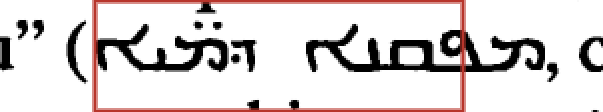

<!-- For God so loved the world that he gave his only begotten Son,
that whoever believes in him should not perish but have eternal life. John 3:16 -->

# Syriac Blank Transcription Handoff Chirho

This is a handoff for one intentionally blank expert-tier span. It is not a transcription, not a confirmation, and not a certification artifact. The span remains blank because the script is Syriac and neither Codex nor Claude should guess the exact letters, dots, vowels, or punctuation.

## Item

- Expert item: `v3-p0151-l010-s3`
- Location: volume 3, page 151, line 10, segment 3
- Script lane: `syriac-chirho`
- Required reviewer role: `Syriac reader`
- Live reviewer URL: `http://localhost:8771/?script-chirho=syriac-chirho&item-chirho=v3-p0151-l010-s3`
- Source scanline: `workspace-chirho/scanlines-chirho/vol-3-chirho/page-0151-chirho/line-010-chirho.png`
- Expert packet image: `workspace-chirho/expert-confirm-pack-chirho/2026-05-31-chirho/images-chirho/vol-3-page-0151-line-010-chirho.png`

## Crop

The boxed region is the current Syriac span geometry: x `767..950` in the 1285px-wide scanline. The crop includes nearby context: the French open parenthesis before the Syriac and the comma after it.



- Crop SHA-256: `bb43be97ee2efea410e39109fcabb3083e1ab3215d9941665adb427631062bde`

## Current Live Line

- Segment 0, French: `vise à traduire`
- Segment 1, Hebrew vision-tier: `שִׁלְחוֹת`
- Segment 2, French: `au sens de “émissions d'eau” (`
- Segment 3, Syriac vision-tier: intentionally blank
- Segment 4, French: `, comme l'interprète`

The Syriac item is boxed and routed, but the UTF-8 text is empty. That emptiness is deliberate: markdown emits an `EMPTY-SPAN` marker and the strict gate stays red until a qualified Syriac reader supplies the exact printed text.

## What The Syriac Reader Should Do

1. Read the boxed Syriac text directly from the print/crop.
2. Supply the exact UTF-8 text, including relevant Syriac letters, dots, vowels, spacing, and punctuation if present.
3. Run the dry-run command first, without `--apply`, using the exact text and reviewer identity:

```bash
bun run apply-expert-supplied-vision-text-chirho -- --id-chirho='v3-p0151-l010-s3' --supplied-text-chirho='<exact printed Syriac text>' --reviewer-chirho='<explicit-human-reviewer-id-chirho>' --reviewer-role-chirho='Syriac reader' --rationale-chirho='<why this exact text is supplied>'
```

4. Apply only after the dry-run reports the intended single blank-span fill:

```bash
bun run apply-expert-supplied-vision-text-chirho -- --id-chirho='v3-p0151-l010-s3' --supplied-text-chirho='<exact printed Syriac text>' --reviewer-chirho='<explicit-human-reviewer-id-chirho>' --reviewer-role-chirho='Syriac reader' --rationale-chirho='<why this exact text is supplied>' --apply
```

Replace every placeholder before running either command. Copied template values
such as `<exact printed Syriac text>` are rejected by the CLI.

The command is role-gated to `Syriac reader`, freshness-gated against the live expert packet, and refuses to overwrite non-empty text. Applying supplied text only fills the blank structural hole. It does not certify the item. After the exact text is supplied and the expert pack/status are regenerated, the same Syriac reader still needs to confirm the item explicitly in the expert reviewer.

## Boundary

- Do not infer the Syriac from Hebrew, Greek, Latin, or context.
- Do not use a placeholder string.
- Do not confirm an empty transcription.
- Do not treat this handoff as proof that the transcription is correct.

This artifact exists to make the unknown visible and actionable while keeping the certification gate fail-closed.
