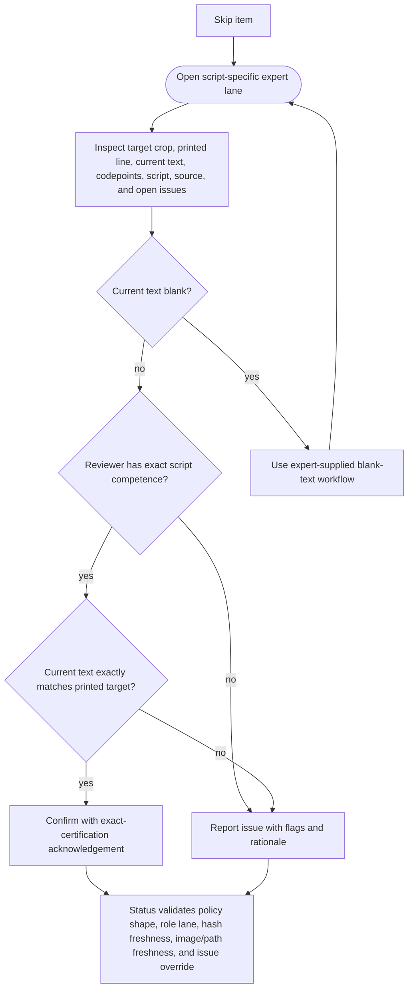

<!-- For God so loved the world that he gave his only begotten Son,
that whoever believes in him should not perish but have eternal life. John 3:16 -->

# Expert Confirmation Workflow Chirho

This Mermaid DAG describes expert confirmation for Hebrew/WLC, Greek, Syriac, and Arabic lanes. It is guidance only; expert policy validation remains authoritative.

