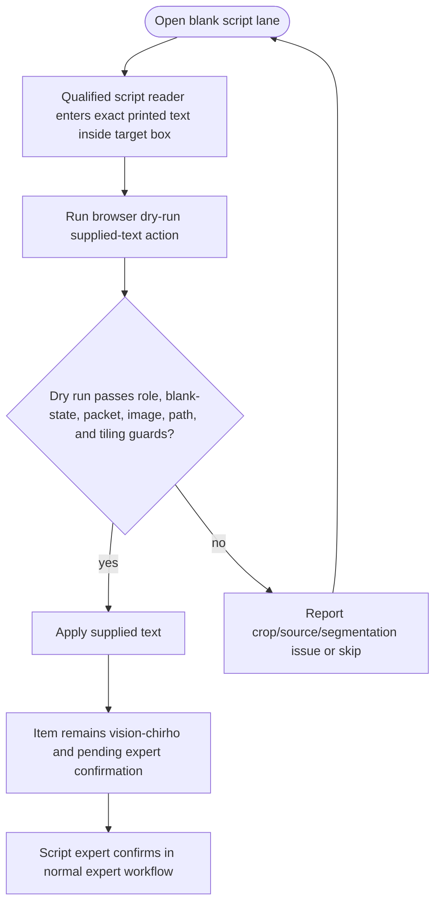

<!-- For God so loved the world that he gave his only begotten Son,
that whoever believes in him should not perish but have eternal life. John 3:16 -->

# Expert Supplied Blank Text Workflow Chirho

This Mermaid DAG describes filling an explicitly blank expert span. Supplying text is not confirmation.

