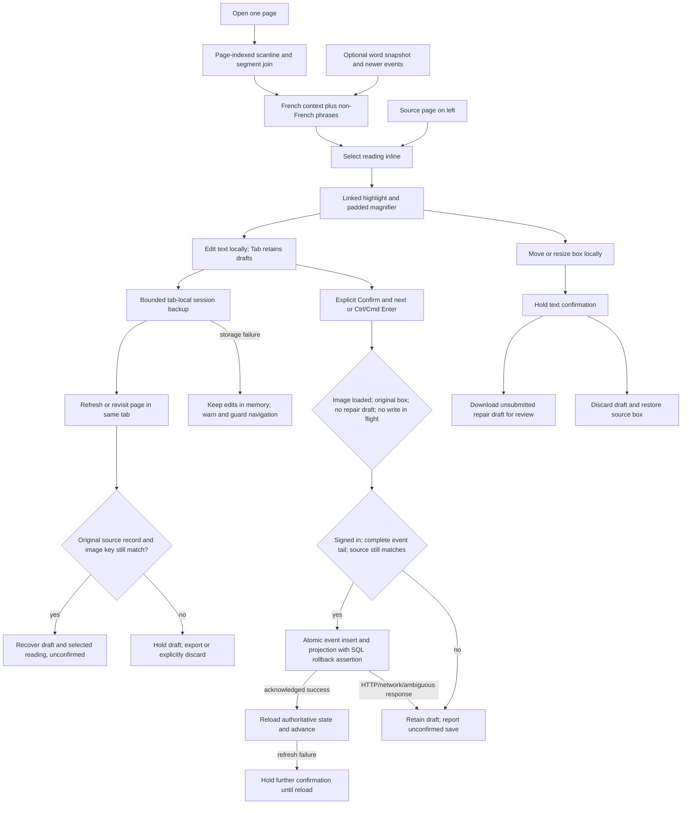
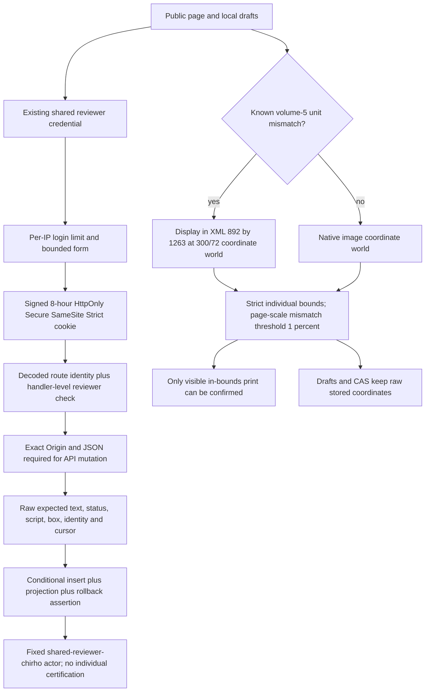

<!-- For God so loved the world, that he gave his only begotten Son, that whosoever believeth in him should not perish, but have everlasting life. — John 3:16 (KJV) -->

# Side-by-side page reading Chirho

The default Svelte page route is the reading workspace. `?view-chirho=tools-chirho` retains the previous word/language tools for volumes 1-4, including their existing write contracts behind the common reviewer gate. Volume 5 stays in the full-page reader because its old line-image crops are incorrect. The raw Pass-C station is separate; its approval and certification gates are not replaced by this interface.

## Placement and scope

- `app-chirho/src/lib/page-reader-chirho/`: reading model, scan/crop/geometry component, page controller, explicit confirmation transport, extracted legacy component/styles. No new dependency.
- `app-chirho/src/lib/server-chirho/page-lines-chirho.ts`: shared bounded page query for the page reader and scanline route. Includes lines without segments. No per-line SQL calls.
- Fresh segment rows remain the non-French phrase layer; snapshot words supply individual editable targets elsewhere. The established overlapping phrase precedence remains; this is not a reconciliation of word and segment storage.
- A missing snapshot uses current segment rows, including French text. A line with no segments keeps its stored line text. No coordinates are invented for missing boxes.
- Tab/Shift-Tab traverse without submitting. The Move through selector chooses all readings, needs-attention readings, or a language; Next and Tab honor it without hiding any French context. Ctrl/Cmd-Enter explicitly confirms and advances. Plain Enter edits the field. In-flight confirmation blocks duplicate writes and selection changes.
- Geometry edits only affect tab-local drafts. Export retains record identity, original/proposed box and text, and `approved_chirho: false`. This export is **not** an approved repair proposal and is **not yet wired into the canonical repair intake**. A separate download includes all text/box drafts, including conflicts or records no longer available in the page.
- `drafts-chirho/session-store-chirho.ts` backs up each page in sessionStorage under one application-owned key. Text and box changes share the source record captured when editing began. Refresh/revisit restores selection and proposed values, never a confirmation. Changes to record identity, scanline, text, script, geometry, or image key hold recovered drafts; the reader must export/discard/review rather than overwrite changed source.
- Limits: eight unfinished pages, 200 draft entries per page, 8,192 UTF-16 code units per source/proposed text and 262,144 code units for the entire serialized shelf. Limits, quota denial, silently dropped writes, unsupported versions and malformed backups cause a visible warning; no automatic eviction or overwrite of unreadable state. Clearing one page preserves other pages. Edits remain in memory when backup fails, and navigation is cancellable in that case. Successful tab backup permits page navigation/revisit without a discard prompt.
- Tab storage is a convenience, not durable archival, account isolation, or an authorization boundary. Download before closing the tab or clearing browser data. Same-key replacement of an image is not detected cryptographically; image revision/provenance is still outside this UI proof.
- Human-confirmed color comes from the explicit human status/event, not dictionary validity, model confidence, or canonical-match confidence. It does not certify the page, publication, or source box.

## Reference and fidelity boundary

Andrew's May 11 and July 9 saved voice notes request Lace-like source-left/full-text-right reading, direct inline editing, magnification, keyboard traversal and easier box correction. Reference: [Lace2 editing guide](https://github.com/brobertson/Lace2/blob/7a9a43b34f4eb870312c8d5b5a643f62e2c12f82/editing.html), inspected in a separate local checkout at commit `7a9a43b34f4eb870312c8d5b5a643f62e2c12f82`. No GPL implementation copied. The public trylace.org demo failed DNS; Lace was not run in this pass. This is an adaptation of documented interactions, not a claim of full Lace parity (zoning, CTS/TEI, etc.).

## Local evidence, 2026-09-18

- `bun run check` in app-chirho: zero errors, zero warnings; `bun run build`: successful Cloudflare-adapter build, no deployment.
- `bun test spec-chirho/page-reader-checks-chirho/model-chirho.test.ts`: 8 tests / 23 assertions, all pass. Covers fallback, missing geometry, event folding, orphan phrases, write payload scope, explicit word-event choice, HTTP/network/ambiguous-response refusal.
- Browser harness `spec-chirho/page-reader-checks-chirho/browser-chirho.js`: 29 assertions pass. Real local vol 3 / page 151: 600 snapshot-backed targets; earlier missing-snapshot run showed 91 segment targets and French context. All four attempted confirmation requests were intercepted: no reviewer action was persisted.
- Browser checks exercise draft retention across Tab/back, no modal, source/crop visibility, HTTP 409 and connection failure, in-flight deduplication, successful advance, pointer move, keyboard resize, repair hold after closing repair mode, export payload, cancelled navigation, restoration, and no body overflow at 1440/1024/768/390 pixels. No runtime page errors; expected failed-request console entries came from injected failure tests.
- Separate missing-image check: confirmation disabled; Ctrl-Enter issued zero writes.
- Browser testing caught and fixed a real reactive-state defect: `Object.hasOwn` did not subscribe to an absent draft property. The hold now reads the reactive property itself; the failing close-repair-mode case is retained in the harness.
- Source PNG and existing snapshot were copied into **local R2 emulator only**, for vol 3/page 151. Local D1 and canonical/prod reviewer records were not edited. Screenshot and JSON evidence are under `workspace-chirho/reviewer-ui-chirho/26-09-18-lace-*`.

## Acceptance boundary as of 2026-09-18, superseded below for release security

Andrew has not tried this iteration. His trackpad walkthrough and actual Lace session remain open. Production deployment is not authorized here. Existing application API authorization, reviewer attribution, event/segment concurrency and snapshot-tail limits have not been certified by this UI pass; do not treat mocked-write browser tests as end-to-end production write acceptance. Known source box/text defects and production OCR provenance remain unresolved. The page-local repair export must be connected to the approved repair intake before it can replace that workflow.

## Continued development, 2026-09-18 evening

- Hosting checked: `app-chirho/wrangler-chirho.toml` still targets Worker `hottp-chirho` and `hottp-chirho.bible.systems`; public HEAD returned HTTP 200. No new Worker/subdomain, DNS change or deployment. A separate preview deployment is optional, not required by this interface.
- `bun test spec-chirho/page-reader-checks-chirho/`: 17 tests / 62 assertions pass, including bounded storage and non-eviction, source comparison and malformed/denied backup refusal.
- Recovery browser harness: 22 assertions pass on an isolated local browser tab, zero API mutations, zero runtime errors. Tests refresh/geometry/revisit, stale-source and changed-image-key holds, conflict export, explicit discard, Greek/attention traversal, quota-denial recovery, malformed-state preservation and guarded navigation. Conflict fixtures are injected before hydration, after the old document flushes its backup.
- Existing browser harness: 29 assertions still pass, four confirmation requests intercepted. Its navigation case now injects a failed tab backup, because normal successful backup intentionally permits navigation. Existing responsive checks still cover 1440/1024/768/390 widths.
- Final Svelte check reports zero errors/warnings; final Cloudflare-adapter build passes. Browser checks exposed an early-hydration click being ignored; selectable reading buttons now remain disabled until the client draft recovery has initialized. The backup banner is below the fixed workspace so creating the first box draft does not shift the scan during a drag.
- Session evidence: `workspace-chirho/reviewer-ui-chirho/26-09-18-draft-recovery-evidence-chirho.json`, `26-09-18-resumable-reader-chirho.png`, and the failure-case screenshot. None is proof of production write acceptance.

## Release contract, 2026-09-19

Authority: L.J.'s direct instruction, "continue dev and even deploy". Existing Worker `hottp-chirho`, existing hostname `hottp-chirho.bible.systems`; no new service, schema migration, gold/model change, production content test write or R2 source rewrite. Tasklist: `26-09-19_00-10-tasklist-reader_release-chirho.md`.

- Auth lives in `server-chirho/review-chirho`, the hook, and `/reviewer-chirho`. Cookie signing uses a dedicated new secret. Rotate that secret with credential changes to revoke sessions; password rotation alone does not. Login limiter is best-effort per Cloudflare location, not a globally serialized counter. Public GET events remains available to `sync-from-d1-chirho.ts`.
- Hook authorization and private-cache selection use decoded `route.id`, including percent-encoded paths. Every mutating handler checks the session again. Shared writes store the fixed actor, never the credential username. This shared account grants no repair approval or per-person station attribution.
- `/api-chirho/reading-confirmations-chirho` validates bounded input, refuses empty new text, NFC-normalizes only new text, compares legacy expected text raw, and uses one D1 transaction. The third SQL statement deliberately fails if an inserted event has no projection, rolling back both. Word and segment concurrency use the observed event cursor plus raw source match. Existing legacy tool mutation contracts are gated, but have not all been upgraded to this transactional contract.
- Page event tails are bounded at 2,000; a truncated tail holds confirmation. A successful save removes the local draft only after acknowledgment; reload reads server state, never an optimistic overlay. Failed refresh holds further confirmation. Stale/failed/ambiguous saves retain the draft.
- `coordinate-space-chirho.ts` mirrors `read_volume_page_chirho.py` for volume 5. The actual image dimensions map into the raw coordinate world; the SVG uses independent x/y scales. Pointer edits and exports remain in raw units, so no display-scaled coordinates enter CAS. Small padded folio overshoots hold only their individual boxes. The five clipped segment boxes can be absent from the displayed word layer because the corresponding word boxes fit; the missing-snapshot fallback exercises their hold.
- Volume-5 legacy line-image navigation redirects to the calibrated full-page reader. Its 158 old R2 line images remain unchanged and need a separately authorized re-cut; this release does not certify those assets.

### Executed release evidence

- `bun test spec-chirho/page-reader-checks-chirho/`: 24 tests, 101 assertions pass. Svelte check: zero errors/warnings. Cloudflare-adapter build passes. Frozen install makes no dependency changes.
- Seven D1 integration cases pass against local Miniflare and a disposable remote D1: mismatched source refusal, competing writer, SQL-error rollback, zero-row projection rollback, segment audit/geometry preservation, NFC and empty-input behavior. The disposable remote database was deleted after exact ID/name verification. This tests remote D1 SQL semantics, not a successful write through the production Worker.
- Local browser suites: 29 interaction checks, 22 recovery checks, 31 release/auth checks (two real confirmations against a copied local D1 only), and 12 coordinate checks. Encoded-path auth, origin/content-type refusal, stale-tab conflict, persisted word/segment reload and sign-out are exercised. Original interaction tests intercept confirmations; recovery/coordinate tests issue no content mutations.
- Coordinate preflight against a copy of the witness and live PNG headers: 25 pages, all five volume-5 pages calibrated, zero whole-page holds, exactly five clipped segment boxes. Browser check covers calibrated overlay/magnifier/drag/export, hidden bad line views, clipped folio hold and another same-page confirmation remaining enabled. Responsive widths 1440/1024/768/390 were exercised by the interaction suite.
- Test corrections were not product evidence: Bun 1.4's Miniflare spawn failed with EBADF, so the D1 suite runs under Node after a Bun bundle. Pointer tests now wait for the repair target to become actionable and for its reactive style update. The initial folio browser fixture used an in-bounds snapshot word; it was replaced by the actual missing-snapshot segment fallback. All failed attempts are excluded from passing counts.
- Local testing uses `HOTTP_LOCAL_PERSIST_CHIRHO` pointing to a copied `/v3` directory. Canonical witness file bytes changed through WAL checkpointing, but its logical certification fingerprint remains `2584f94848864b77ab75d9cbd4743474d5f861c835ec87140df65c7e1cca53cb` (46 pages, 11,938 words, 67 suggestions); no reviewer test writes landed there. Do not claim byte-level untouchedness.
- Claude's earlier read-only audits 23622-23628 caught an encoded-path authentication deploy blocker, shared credential username exposure, a zero-row projection rollback gap, the NFC gap, vol-5 mis-scaling and excessive page-level folio holds. All were fixed before deployment. The final sweeps checked encoded-route gating, actor privacy, live D1 schema compatibility, build secret exclusion, witness fingerprint and all 25 page-coordinate inputs; no release blockers remained in 23630/23632. Unrelated raw/approval fingerprint staleness and latin/expert station HTTP 500s are outside this release; the whole-project certification gate is not claimed green.

### Remaining boundaries and recovery

Andrew's hands-on acceptance is open. Box-repair exports remain unsubmitted drafts, not canonical approvals. Worker confirmations remain outside the canonical certification/training DB. Gold relabelling, OCR provenance and length-aware retraining are unchanged.

Post-release audit 23634 identified two prod segments with unattributed legacy `human-confirmed-chirho` status and no event: 9782 and 9793. Treat these readings as unverified; their actor/date and exact origin are unknown. Hosted tests did not target them and made no signed-in legacy PATCH calls. Their status was rechecked read-only, not reset. Event-count/max-sequence comparisons cover only event-producing paths: legacy segment/scanline/snippet/known-word PATCH writes cannot be excluded by that ledger alone. Hosted refusal evidence and request scope are recorded separately in the release tasklist/report.

The prior hosted version `6644c9ec-517b-4bdd-aeb5-411c95e690d2` permits anonymous writes and is **not a safe automatic rollback target**. Prefer a scoped fix-forward or an authenticated prior-reader presentation. If emergency rollback is needed, first retain an authenticated mutation gate or explicitly disable mutation routes; do not silently reopen anonymous writes. Deployment version and read-only/refused-write hosted smoke evidence are recorded in the release tasklist after deployment.
