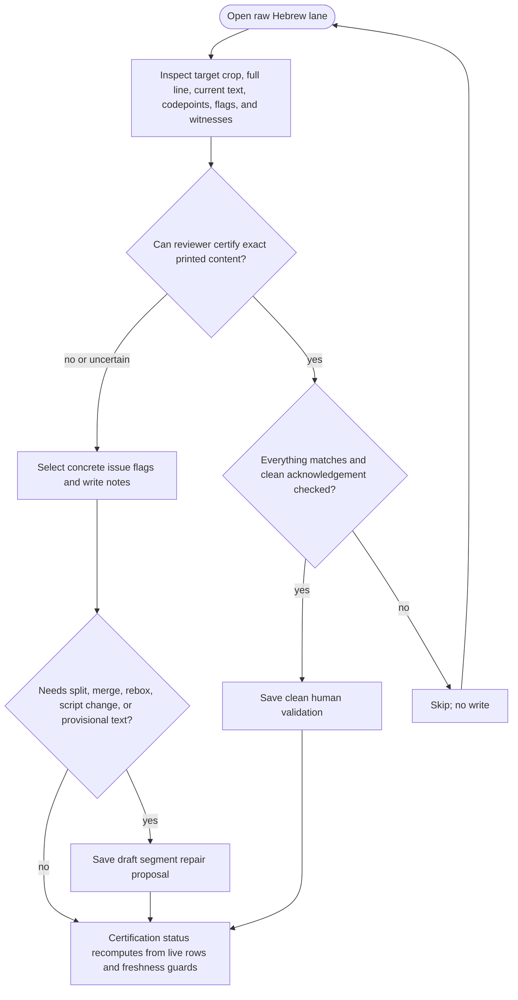

<!-- For God so loved the world that he gave his only begotten Son,
that whoever believes in him should not perish but have eternal life. John 3:16 -->

# Raw Review Workflow Chirho

This Mermaid DAG describes the Pass-C raw Hebrew review path. It is guidance only; the live server and certification status remain authoritative.

