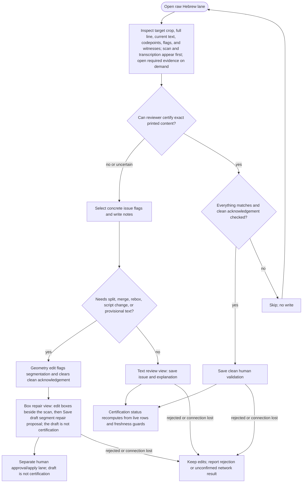

<!-- For God so loved the world that he gave his only begotten Son,
that whoever believes in him should not perish but have eternal life. John 3:16 -->

# Raw Review Workflow Chirho

This Mermaid DAG describes the Pass-C raw Hebrew review path. It is guidance only; the live server and certification status remain authoritative.

The browser presentation lives in `src-chirho/human-review-ui-chirho/`, separate from the server's queue and write guards. All presentation modules participate in source freshness fingerprints. Plain Enter activates the focused control; Ctrl/Command+Enter saves only the visible task. A changed box draft cannot pass the clean-review client gate, even if its segmentation flag is manually cleared. The server still requires trusted reviewer attribution, matching display/source state and explicit clean acknowledgement.

Local browser regression: `spec-chirho/browser-checks-chirho/reviewer-workspace-chirho.js`, run against a disposable station on port 8876. It intercepts all POSTs and checks keyboard routing, rejected/network-failed saves, scaled-image drag, read-only rows and responsive layout. This is implementation evidence, not Andrew's acceptance or source-text certification.
