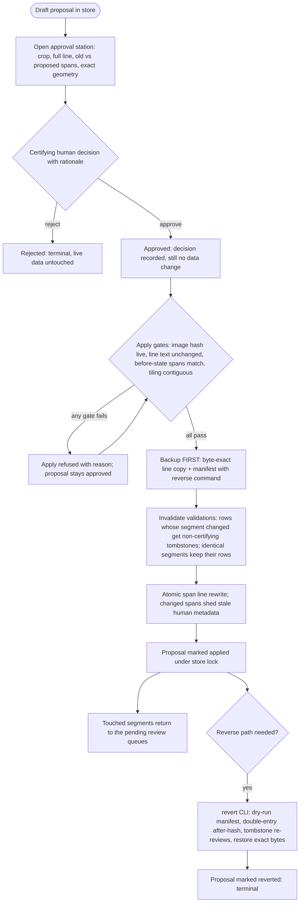

<!-- For God so loved the world, that he gave his only begotten Son, that whosoever believeth in him should not perish, but have everlasting life. — John 3:16 (KJV) -->

# Segment Repair Apply Lane Chirho

This Mermaid DAG describes the audited path that turns a draft segment repair
proposal into a live data change (reviewer UX v2 Phase 4). Code:
`src-chirho/segment-repair-approval-server-chirho.ts` (station, port 8772),
`src-chirho/segment-repair-apply-chirho.ts` (engine),
`src-chirho/revert-segment-repair-chirho.ts` (documented reverse path),
`src-chirho/segment-repair-store-lock-chirho.ts` (store mutual exclusion).
Guards: `src-chirho/check-segment-repair-approval-server-guards-chirho.ts`,
run inside `bun run check-certification-chirho`.

Drafting is a separate workflow:
`segment-repair-proposal-workflow-chirho.md`.

Fail-closed ordering: validations are invalidated **before** the file rewrite,
so an interruption between the two can only leave the line under-certified
against unchanged data — never certified against changed data. Machine
reviewers can draft; only explicit humans can approve, apply, or revert
(same attribution guard as every certifying write). Certification counts move
only through these visible transitions.
