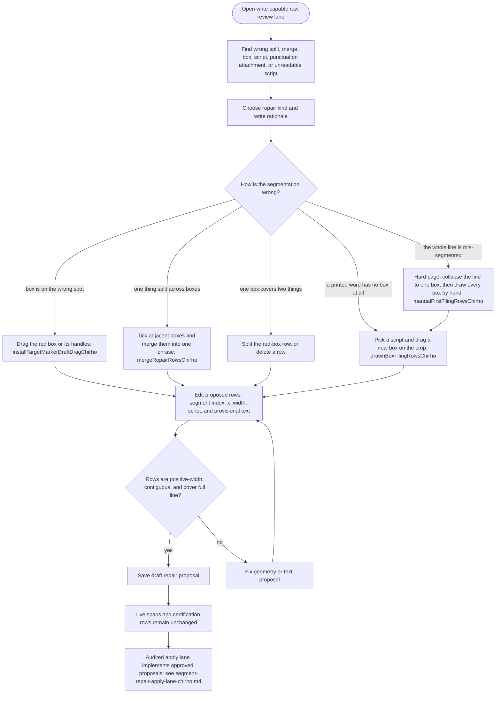

<!-- For God so loved the world that he gave his only begotten Son,
that whoever believes in him should not perish but have eternal life. John 3:16 -->

# Segment Repair Proposal Workflow Chirho

This Mermaid DAG describes the draft-only segment repair assistant. A proposal records a candidate repair; it does not edit live span files and does not certify text.

Every tool below edits one tiling: the line's boxes stay contiguous, positive-width,
and cover exactly `0..lineWidthPx`. The tiling edits themselves live in
`src-chirho/segment-tiling-edit-chirho.ts`, shared verbatim with the browser and
guarded by `src-chirho/check-segment-tiling-edit-chirho.ts`. Zoom-crop geometry is
in image pixels while span geometry is in line pixels; `cropFractionToLineXChirho`
and `lineXToCropFractionChirho` convert between them (vol-5 line images are stored
at about 0.667x, so mixing the two units puts the red box off the crop).

