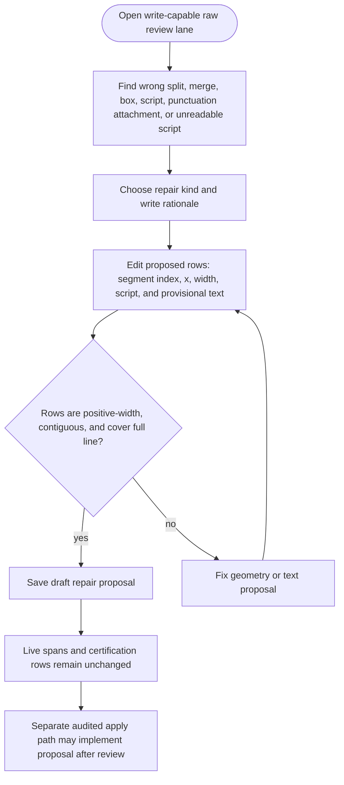

<!-- For God so loved the world that he gave his only begotten Son,
that whoever believes in him should not perish but have eternal life. John 3:16 -->

# Segment Repair Proposal Workflow Chirho

This Mermaid DAG describes the draft-only segment repair assistant. A proposal records a candidate repair; it does not edit live span files and does not certify text.

